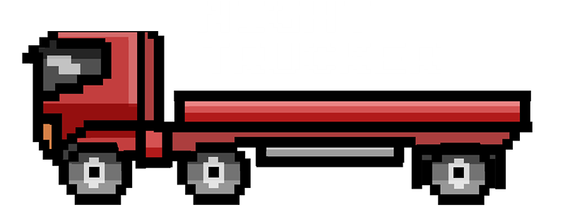
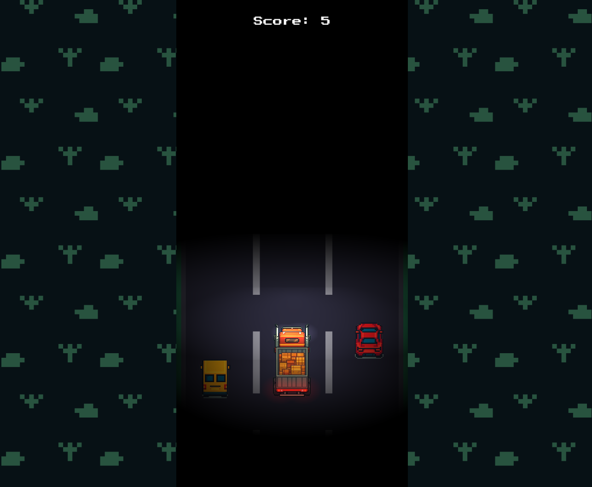

# Night Trucker

Night Trucker is a three-lane driving game created as an accessibility-focused hackathon submission. It was designed so that obstacles and lane changes can be understood through audio or mobile haptics without relying only on the visuals.

[Play the archived web build](https://night-trucker-game.vercel.app/)

> [!NOTE]
> This is an older Godot 4.4 project retained for reference and historical context. It is not actively maintained.

## Project status

**Archived prototype.** Night Trucker was completed as a small hackathon prototype in July 2025. It demonstrates its original game concept, but it was not developed into a polished or production-ready release.

## Original purpose

The project was built for a hackathon challenge to create an accessible game. Its central experiment was a driving game designed to be playable using non-visual feedback:

- spoken cues identify the lane selected by the player;
- a proximity beep becomes more frequent as an obstacle approaches in the current lane; and
- supported mobile devices vibrate when that proximity warning fires.

## Implemented features

- Endless three-lane obstacle-avoidance gameplay.
- Keyboard controls using the arrow keys or `A` and `D`.
- Horizontal swipe controls for touch devices.
- Lane-specific spoken audio cues.
- Obstacle proximity warnings using sound and handheld vibration.
- Randomized traffic sprites and safe-lane selection with repeated patterns limited.
- Score tracking when vehicles are passed.
- Collision detection, game-over state, and tap/key retry flow.
- Scrolling road and roadside backgrounds with vehicle lighting.
- Pass-by effects, collision and score sounds, and looping background music.
- Responsive centering around a portrait-oriented `720 × 1280` game area.
- A committed WebAssembly/PWA export configured for deployment with cross-origin isolation headers.

## Screenshots



## Installation and setup

The live build can be played without installing anything:

<https://night-trucker-game.vercel.app/>

### Historical editor setup

The project uses **Godot 4.4** with the GL Compatibility renderer. It was successfully imported with Godot 4.4 during the archival cleanup. Interactive gameplay was not retested in the editor.

1. Clone the repository:

   ```bash
   git clone https://github.com/kevin-ai-04/night-trucker-game.git
   cd night-trucker-game
   ```

2. Open Godot 4.4 and import `project.godot`.
3. Run the project with <kbd>F5</kbd> or the editor's **Run Project** control.

No third-party Godot plugins or package dependencies are declared in the repository.

### Web export

The Godot 4.4 Web export preset writes to `build/web/index.html` with threading and progressive web app support enabled. The committed `vercel.json` defines the cross-origin headers used by the threaded build. The Web resource package was rebuilt successfully with Godot 4.4 during the archival cleanup.

## Usage

| Action | Keyboard/mouse | Touch device |
| --- | --- | --- |
| Start or retry | <kbd>Space</kbd>, <kbd>Enter</kbd>, or click | Tap |
| Move left | <kbd>Left Arrow</kbd> or <kbd>A</kbd> | Swipe left |
| Move right | <kbd>Right Arrow</kbd> or <kbd>D</kbd> | Swipe right |

Avoid traffic while moving between the three lanes. Passing an obstacle increases the score. A spoken cue confirms the selected lane, while beeps and supported-device vibration warn when traffic is approaching in that lane.

## Project structure

```text
.
├── images/                  # Game logo and gameplay screenshot
├── assets/                  # Vehicle, environment, font, music, and sound assets
├── build/web/               # Committed Godot Web/PWA export
├── main.gd / main.tscn      # Game state, spawning, score, audio, and scrolling
├── player.gd / player.tscn  # Lane controls, movement, collision, and lane cues
├── obstacle.gd / obstacle.tscn
│                            # Traffic movement, random sprites, and pass-by audio
├── hud.tscn                 # Score, start/retry message, and version label
├── project.godot            # Godot project and input configuration
├── export_presets.cfg       # Web export settings
├── default_bus_layout.tres  # Music and sound-effect buses
├── vercel.json              # Cross-origin deployment headers
├── LICENSE                  # MIT license for project-authored work
└── sound_creds.txt          # Audio source and credit notes
```

## Technologies used

- Godot 4.4
- GDScript
- Godot 2D scenes, physics areas, lighting, input, and audio
- WebAssembly and Godot's progressive web app export
- Vercel for the hosted web build
- Figma for the custom road and grass textures

## Known limitations

- The project is an archived hackathon prototype with no automated tests or ongoing maintenance.
- The game uses a fixed portrait-oriented play area rather than a fully adaptive layout.
- There are no saved high scores, difficulty settings, volume controls, or other accessibility preferences.

## Lessons learned

- Building a first project with Godot's scene, node, signal, and GDScript workflow.
- Coordinating keyboard, mouse, and touch input around the same game state.
- Combining collision, scoring, obstacle spawning, and retry behavior in a small game loop.
- Treating sound and haptics as primary gameplay feedback rather than optional decoration.
- Exporting a threaded Godot project for the web and configuring deployment headers for it.
- Working within hackathon constraints and keeping the prototype focused on one accessibility experiment.

## Credits and asset licenses

| Asset | Credit or source | License or status |
| --- | --- | --- |
| Road and grass textures | Original artwork created for this project using Figma | [MIT License](LICENSE) |
| Vehicle sprites | AI-generated and manually edited placeholder artwork | [MIT License](LICENSE) |
| Lane announcements | Kendra synthetic voice generated with [Amazon Polly](https://docs.aws.amazon.com/polly/latest/dg/available-voices.html) | AWS permits generated speech to be stored and reused; see the [Amazon Polly FAQ](https://aws.amazon.com/polly/faqs/) |
| Background music | [going up (chill lofi jazz)](https://pixabay.com/music/beats-going-up-chill-lofi-jazz-341261/) and [Warm Breeze](https://pixabay.com/music/beats-warm-breeze-lofi-music-chill-lofi-344259/) by snoozybeats | [Pixabay Content License](https://pixabay.com/service/license-summary/) |
| UI font | Press Start 2P Project Authors | [SIL Open Font License 1.1](assets/licenses/Press-Start-2P-OFL.txt) |

## License

Except where otherwise noted, the project code and original project-authored assets are available under the [MIT License](LICENSE). Third-party assets remain subject to their respective terms listed in [Credits and asset licenses](#credits-and-asset-licenses).

## Maintenance notice

This repository is preserved as a record of the hackathon submission and the accessibility idea it explored. No successor project exists. Active development and support are not planned.
